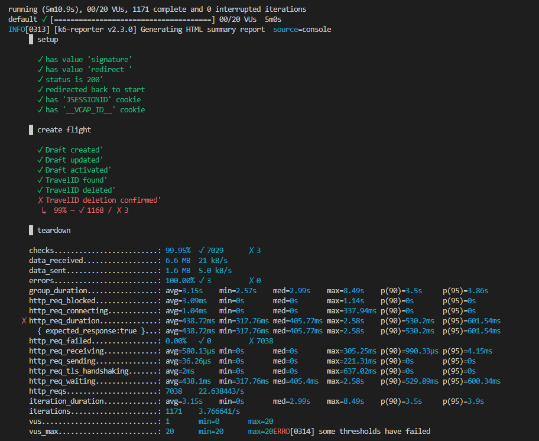
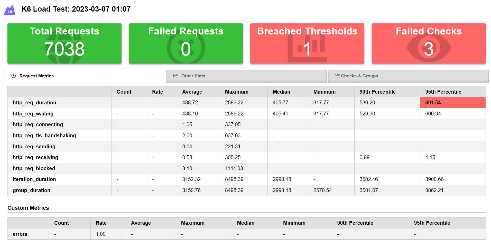

# Test performance as early as possible
As organizations move more of their applications to the cloud, it's becoming increasingly important for developers to ensure that their applications are performing optimally in cloud environments. This means that performance testing and load testing need to be incorporated into the development process from the very beginning, rather than later as an afterthought.

By incorporating performance testing and load testing into the Definition of Done (DoD) of a user story, not only ensures that stakeholders expectations are met, but it allows developers to incorporate performance testing and load testing into the development process. Meaning they can identify and address performance issues early in the development process. This can save time and money in the long run, as it is typically easier and less expensive to fix performance issues early in the development process than it is to fix them later.

To incorporate performance testing in-sprint, developers need to use tools and techniques that are designed for this purpose. One such tool is k6, an open-source load testing tool that is designed to be easy to use and integrate into the development process. With k6, developers can write load testing scripts in JavaScript, which makes it easy to incorporate load testing into existing development workflows.
Another technique that can be used for is continuous performance testing. With continuous performance testing, developers can automate the performance testing process and run performance tests continuously throughout the development process. This can help to identify performance issues as soon as they arise, rather than waiting for scheduled performance tests.

# Why K6?
- K6 tests are written in JavaScript which means a familiar low barrier to entry for developers.
- K6 is open source, which means it is free to use and can be customized as needed. This can be particularly useful for small teams or individual developers who may not have the budget for a commercial performance testing tool like LoadRunner.
- K6 collects a wide range of performance metrics during testing, including response times, error rates, and resource utilization. These metrics can be used to identify performance issues and ensure that SLAs are being met.
- K6 allows developers to set thresholds for performance metrics. If a threshold is exceeded during testing, K6 can automatically fail the test, indicating that the SLA has not been met.
- K6 has integrations with a wide range of tools, including Grafana, InfluxDB, and Jenkins etc. This can make it easier to analyse and visualize test results and integrate into DevOps workflows.
- K6 has many converters, making it easy to convert exising JMeter, Postman, Swagger/OpenAPI and HAR files into K6 tests
- K6 is very lightweight which means it can be run from any location, by anyone, very handy for determine location based issues

# K6 getting started
install
https://k6.io/docs/get-started/

```
$ k6 run script.js
```

# Example scripts
End to End CAP Sflight API test [sflightAPI.js](./sflightAPI.js)

End to End CAP Sflight app deployed in BTP Launchpad [sflightLaunchpadE2E.js](./sflightLaunchpadE2E.js)

## Output
test-run behavior
```js script
  stages: [
    { target: 50, duration: "1m" }, // Linearly ramp up from 1 to 50 VUs during first minute
    { target: 50, duration: "3m30s" }, // Hold at 50 VUs for the next 3 minutes and 30 seconds
    { target: 0, duration: "30s" }     // Linearly ramp down from 50 to 0 50 VUs over the last 30 seconds
    // // Total execution time will be ~5 minutes
  ],
  thresholds: {
    "http_req_duration": ["p(95)<500"], // We want the 95th percentile of all HTTP request durations to be less than 500ms
    "http_req_duration{staticAsset:yes}": ["p(99)<250"],   // Requests with the staticAsset tag should finish even faster eg SAPUI5
    // Thresholds based on the custom metric we defined and use to track application failures
    "check_failure_rate": [
      "rate<0.01",      // Global failure rate should be less than 1%
      { threshold: "rate<=0.05", abortOnFail: true }  // Abort the test early if it climbs over 5%
    ]
  }
```
test-run results




Note some thresholds not met, We want the 95th percentile of all HTTP request durations to be less than 500ms and it was much higher as we scaled up the Virtual Users

see [Test Application Autoscaler](https://github.com/SAP-samples/btp-build-resilient-apps/tree/main/tutorials/13_setupautoscaler) this is where the CF Autoscaling helps, trigger new instances to meet the changes in workload and stay within the SLA



[sample report](https://raw.githack.com/jasper07/k6btplaunchpad/main/result.html)

# Conclusion
Overall, performance testing is an essential part of the development process for developing for the cloud.

 By incorporating performance testing and load testing into each sprint, developers can identify and address performance issues early in the development process, which can save time and money in the long run. With the right tools and techniques, in-sprint performance testing can be easily integrated into existing development workflows.
